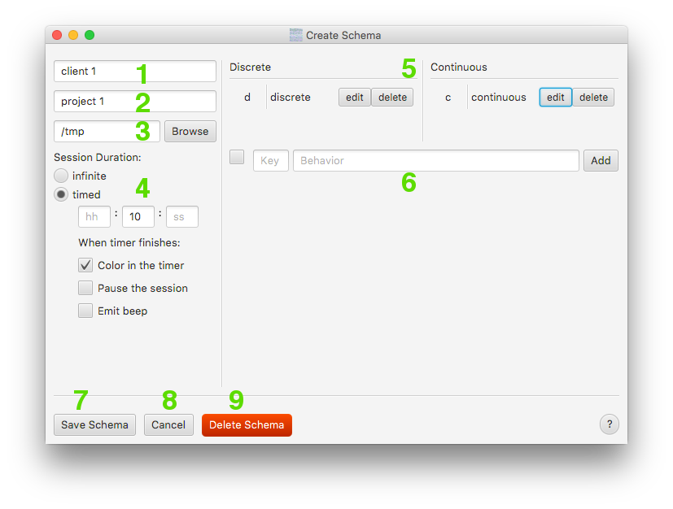
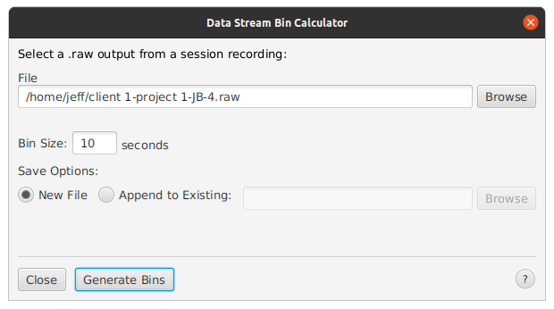
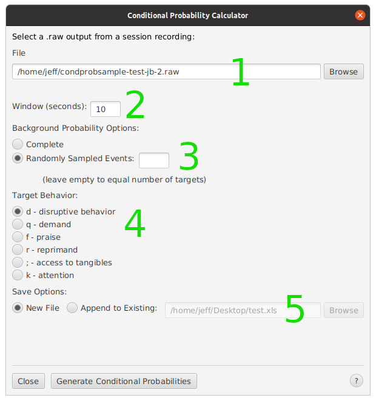

<link rel="stylesheet" href="markdown3.css">

- [Introduction](#introduction)
- [Start Menu](#start-menu)
- [Edit Schema](#edit-schema)
- [Preferences](#preferences)
- [Recording](#recording)
  - [Logging Behaviors](#logging-behaviors)
  - [Logging New Behaviors](#logging-new-behaviors)
  - [Undoing Behaviors](#undoing-behaviors)
  - [Adding Notes to a Session](#adding-notes-to-a-session)
  - [Session Output](#session-output)
  - [Keyboard Shortcuts](#keyboard-shortcuts)
- [IOA Calculator](#ioa-calculator)
  - [IOA Methods](#ioa-methods)
    - [Exact Agreement](#exact-agreement)
    - [Partial Agreement](#partial-agreement)
    - [Time Window](#time-window)
- [Bin Calculator](#bin-calculator)
- [Conditional Probability](#cond-prob)
- [References](#references)

# Introduction

Behavior Logger is a data collection tool for applied behavior analysis.
The interface was designed for practitioners conducting treatment while one or more
data-collectors record behaviors.

---

# Start Menu

1. **Schema List** - A list of current schemas saved on your computer.
2. **Create** - Opens a new [Edit Schema](#edit-schema) menu for creating a new schema.
3. **Edit** - Opens the selected schema into an [Edit Schema](#edit-schema) menu.
4. **Export** - Allows the user to export a schema into a ".schema" file, to be shared with other users.
5. **Import** - Allows the user to import a new schema by selecting a ".schema" file.
6. **Preferences** - Opens the [Preferences](#preferences) menu for setting default schema values.
7. **IOA Calculator** - Opens the [IOA Calculator](#ioa-calculator).
8. **Bin Calculator** - Opens the [Bin Calculator](#bin-calculator).
9. **Conditional Probability** - Opens the [Conditional Probability Calculator](#cond-prob).
10. **Key-Behavior Mappings** - A summary of the selected schema's key-behavior mappings.
11. **New Session Summary** - The details to be applied to the upcoming session.
    - *Duration* - The duration of the session (set by the schema).
    - *Observer* - The name of the observer collecting data.
    - *Therapist* - The name of the therapist performing the treatment.
    - *Condition* - The type of treatment being applied.
    - *Location* - The location where the session is taking place.
    - *Session #* - The number of the next session. This number will increment automatically between sessions.
    - *Data File* - The name of the data-file the next session will generate. Users can configure this in [Preferences](#preferences). The app will warn the user if this file will overwrite an existing one of the same name.
12. **Start New Session** - Starts a new session in the [Recording](#recording) menu.

---

# Edit Schema

1. **Client** - An identifier for the client.
2. **Project** - The research project this schema is for.
3. **Session Data Directory** - The directory session data-files will get saved to.
4. **Session Duration**
  - *infinite* - If checked, sessions will never end.
  - *timed* - If checked, sessions will be considered "finished" when they reach the set duration. If this field is set to zero, or left empty, it's the same as checking *infinite*.
  - *When timer finishes* - Check the actions you would like to happen when a session is over.
5. **Key-Behavior Mappings** - The keys used to record target behaviors. They are divided between *Discrete* and *Continuous* behaviors. You can *edit* or *delete* each behavior listed.
6. **Add Behavior** - Adds a new row to the Mappings section.
  - *Cont.* - Check if this is a *continuous behavior* (ie. it has a duration rather than a count).
  - *Key* - A single character to represent the behavior. Accepted character include lower-case letters, digits, and some symbols ( ` '  - = [ ] ; , . \ / )
  - *Behavior* - A description of the target behavior.
7. **Save** - Saves changes and returns to Start Menu. If this is a new schema, it will show up in the schema list.
8. **Cancel** - Discard all changes and return to Start Menu.
9. **Delete Schema** - Deletes the current schema. Prompts the user for confirmation.

---

# Preferences

1. **Default Save Location** - New schemas will start with this directory.
2. **Filename Format** - Since most researchers have a preferred naming structure for their data-files, we allow users to customize them. Check each component that you want to include in the filename. You can also drag-and-drop components to reorder them.
3. **Default Session Duration** - New schemas will start with this duration setting. See the [edit-schema menu](#edit-schema) for an explanation of each option.

---

# Recording

1. **Behavior Summary** - Each row keeps track of the count/duration of each behavior.
2. **Timer** - The timer will increase while recording. If the current schema has a set duration and the timer reaches it, it performs the checked actions as specified in the [edit-schema menu](#edit-schema).
3. **Start Session/Continue** - When pressed, it will start the session timer. You can also press `spacebar` as a shortcut (see [Keyboard Shortcuts](keyboard-shortcuts)). You can only record behaviors while the timer is active.
4. **Add Notes** - Displays a window where you can attach notes to the session.
5. **Start New Session** - Starts a new session with the same schema and same session-detais. The session #, however, will increment.
6. **Edit Uknown Behaviors** - Becomes visible if you have logged an unknown behavior. When clicked, it opens a new menu for assigning values to unknown behaviors.

## Logging Behaviors
While a session is playing, press any of the mapped keys to log a behavior. **Discrete** behaviors flash green and the counter will increment. **Continuous** behaviors toggle on and off.

## Logging New Behaviors

You can also log new behaviors on the fly while recording.

**Discrete** - press an unmapped key.
**Continuous** - press an unmapped key while holding `shift`. Once the new continuous key is added, you don't have to hold `shift` to toggle it again.

When you pause the session, you can click *Edit Unknown Behaviors* to assign values to any unknowns you might have logged. If you logged an unknown by mistake, you can ignore it.

## Undoing Behaviors

You can undo behaviors using `ctrl`+`z` for Windows and `cmd`+`z` for Macs (see [Keyboard Shortcuts](#keyboard-shortcuts) for a full list of shortcuts). There is no "redo" funcationality yet.

*Undo* works differently depending on what the latest behavior was.
For discrete behaviors it simply removes the behavior and decrements the counter by 1.
For a continuous behavior that has been *started* but hasn't *ended*, it reverts the counter back to its position before it started.
For a continuous behavior that has ended, it decrements the counter by whatever the duration was.

## Adding Notes to a Session

At any time, you can attach notes to a session. Open the Notes menu by pressing the "Add Notes" button or by using the keyboard shortcut `ctrl`+`n` for Windows or `cmd`+`n` for Mac (see [Keyboard Shortcuts](#keyboard-shortcuts)). You can type anything into the text area and your notes will be automatically saved in the [session output](#session-output) along with the session's data stream.

## Session Output

The app saves logged behaviors in the directory specified by the Schema (see [Edit Schema](#edit-schema)). It outputs two files per session:

- a human-readable *Excel* file summarizing the session
- a *RAW* file meant to be read by other programs, such as the [IOA Calculator](#ioa-calculator)

The names of these files can be configured in [Preferences](#preferences).

## Keyboard Shortcuts

### Recording Menu
- `spacebar` - start/stop the session
- `ctrl`+`z` / `cmd`+`z` - undo
- *any unmapped key* - log an unknown discrete behavior
- `shift`+*any unmapped key* - log an unknown continuous behavior

### Session Notes
- `ctrl`+`n` / `cmd`+`n` - open Notes
- `esc` - close Notes (if open)
- `ctrl`+`t` / `cmd`+`t` - insert current session timestamp

---

# IOA Calculator

1. **File 1 / File 2** - Paths to the *.raw* data-files you wish to compare. You should upload the data output from your behavior recording sessions.
2. **Method** - The type of calculation to be done. See [IOA Methods](#ioa-methods).
3. **Block Size/Threshold**
  - *Block Size* - The number of seconds designated to each partition in partial/exact agreement.
  - *Threshold* - The number of seconds of leniency in time-window analysis.
4. **Save Options**
  - *New File* - Will prompt you to specify a file name and location and will create a new file (or overwrite an existing one)
  - *Append to Existing* - Requires you to enter a path to an existing Excel file. This option will append a new Excel Sheet to the existing workbook.
5. **IOA Summary** - After generating IOA results, this box displays the summary of IOA for each key.
6. **Generate IOA File** - Calculates IOA between File 1 and File 2 and, if *New File* is selected, prompts the user to save the result in an Excel file.

## IOA Methods

Each method below details how to calculate a percent agreement for each behavior logged by two observers during a session. These methods were derived from [MacLean et al. (1985) and Mudford et al. (2009)](#references).

### Exact Agreement

*Exact agreement* outputs a single percent agreement for a behavior between both observers. The data-logs from File 1 and File 2 get partitioned into intervals of a size specified by `block-size`. For each interval, the observers are considered in agreement if they both recorded the same number of occurrences within the interval. A behavior's percent agreement is equal to the number of agreements divided by the total number of intervals and multiplied by 100%.

### Partial Agreement

Similar to *exact agreement*, the data-logs from File 1 and File 2 get partitioned according to `block-size`. A score between 0 and 1 is calcuated per interval by dividing the smaller of the two behavior counts by the larger. If both counts are zero, the score equals 1. A behavior's percent agreement is equal to the sum of all scores divided by the number of intervals, multiplied by 100%.

### Time Window

*Time window* varies from the other two in that it generates two percent agreements for each discrete behavior (one for each observer) and one percent agreement for continuous behaviors.

For **discrete behaviors**, each occurrence within each data-log is given a score of 0 or 1. A behavor recorded by one observer gets a 1 if the other observer recorded the same behavior within &plusmn; `threshold` seconds. If the behavior does not have a match within the bounds set by `threshold`, it gets a score of 0. The discrete behavior's percent agreement for each observer is equal to the sum of the scores, divided by the total occurrences, and multipled by 100%.

For **continuous behaviors**, the `threshold` does not matter. The data-log is partitioned into 1-second intervals. A continuous behavior's percent agreement is equal to the number of intervals where both observers recorded it, divided by the number of intervals where either of the observers recorded it, multiplied by 100%.

---

# Bin Calculator

The "Bin Calculator" is useful for looking at within-session patterns in the data by looking at the number or duration of responses that occur within different “bin” sizes (e.g., 1 minute, 2 minutes, 5 minutes). Like IOA Calculator, you simply pick a raw data file, a bin size, and a save option.

---

# Conditional Probability

1. **File** - Path to the *.raw* data-file you wish to analyze.
2. **Window** - Number of seconds after the target behavior to sample consequences.
3. **Background Probability Options**
    - *Complete* - The background probability is calculated by sampling every second.
    - *Randomly Sampled Events* - The sampling is either set to an exact number or, if empty, matched to the number of instances of the target behavior.
4. **Target Behavior** - The behavior you wish to analyze.
5. **Save Options** - See IOA Calculator save options.

The Conditional Probability Calculator is used to determine the likelihood of a consequence (or potentially reinforcing event) occuring within a certain time window after a target event. You can compare this calculation to the background probability (or the response-independent probability) of the consequence to determine if a target and consequence events may be correlated.

The output includes four calculations using two factors:

1. **Binary / Proportional**
    - *Binary* - The consequence event is scored as either occurring (yes=1) or not (no=0).
    - *Proportional* - The consequence event is scored as the proportion of the time window (between 0 and 1).
2. **Establishing Opertaions (EO) / Non-Establishing Operations (non-EO)**
    - *EO* - The calculation includes only instances of target behavior that occurred during establishing operation (while the “consequent” event of interest isn’t already happening when the response occurs).
    - *Non-EO* - The calculation includes all instances of target behavior.

The algorithms for this calculator were derived from [Vollmer et al. (2001)](#references).

---

# References

MacLean, W.E., Tapp, J.T., Johnson, W.L. (1985). Alternate Methods and Software for Calculating Interobserver Agreement for Continuous Observation Data. *Journal of Psychopathology and Behavioral Assessment, 8*.

Mudford, O.C., Taylor, S.A., & Martin, N.T. (2009). Continuous Recording and Interobserver Agreement Algorithms Reported in the Journal of Applied Behavior Analysis (1995-2005). *Journal of Applied Behavior Analysis, 42, 165-169.*

Vollmer, T.R., Borrero, J.C., Wright, C.S. (2001). Identifying Possible Contingencies During Descriptive Analysis of Severe Behavior Disorders. *Journal of Applied Behavior Analysis, 276-277*